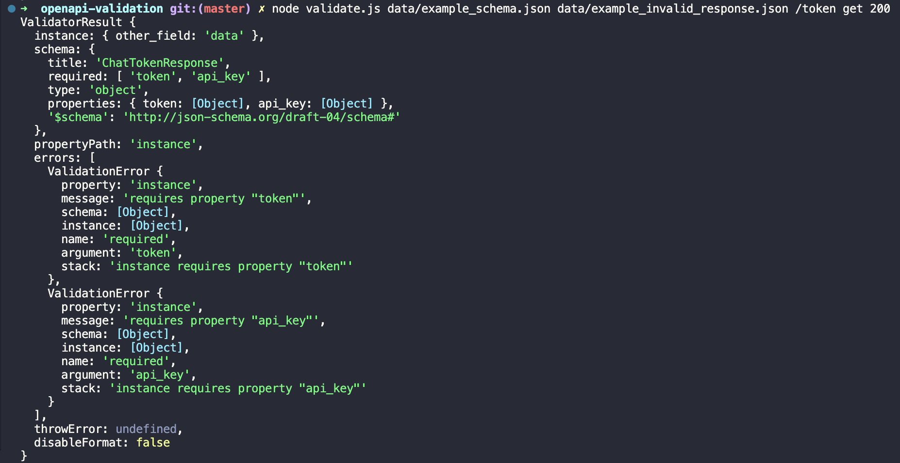

## openapi-validation

This small script can help you validate if a response from a service truly conforms to the OpenAPI contract defined for it.

This is based on the [OpenAPI 3](https://swagger.io/specification/) specification.

I used this in a project where instead of generating the OpenAPI specs from the models in the service (which I recommedn you do) we first wrote the specifications and then implemented them. The idea of first writing the specs then the implementation is nice, but in retrospect, it leads to many issues and differences because the spec is not necessarily true.

```shell script
npm install
npx openapi2schema -i data/example_schema.yaml -p >| data/example_schema.json

node validate.js data/example_schema.json data/example_valid_response.json /token get 200
node validate.js data/example_schema.json data/example_invalid_response.json /token get 200
```




## Credits

The script simplifies the use of the [jsonschema](https://www.npmjs.com/package/jsonschema) validator which is used to validate the response.

To use use the jsonschema we first need to convert our OpenAPI spec to a jsonschema with the [openapi2schema](https://www.npmjs.com/package/openapi2schema) package.